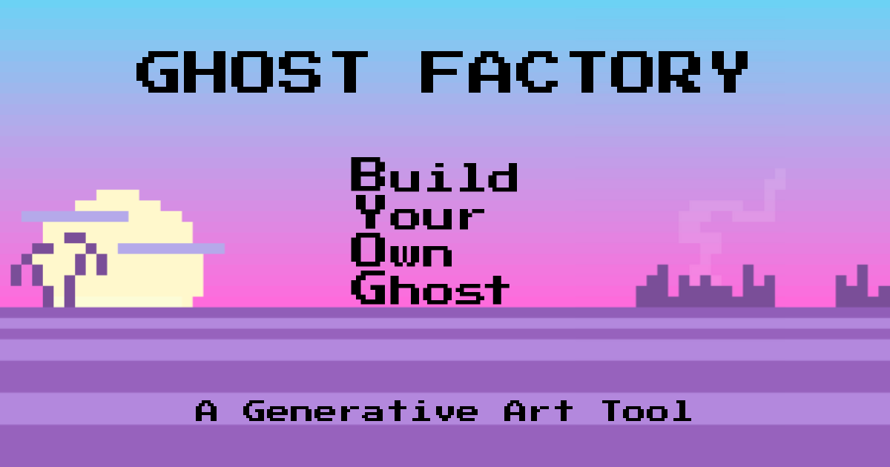

# Ghost Factory

Ghost Factory is an open-source layered trait composer for creators building character art, avatars, stickers, animations, and PFP-style image stacks.

It started as a creative tool for the Dead Pixels Ghost Club community, but the core idea is reusable: choose layered assets, lock the traits you want to keep, randomize the rest, export finished images, build frame-based animations, and use the project as a template for your own trait builder.

[Live demo](https://ghost-factory.vercel.app) · [GitHub repository](https://github.com/Entheosophy/ghost-factory)



## What It Does

- Compose layered character art from organized trait folders.
- Lock individual layers while randomizing other layers.
- Use full-random or semi-cohesive randomization.
- Export PNGs in large, sticker, and emoji sizes.
- Build simple frame-based animated GIFs.
- Load existing DPGC NFTs by serial and remix their traits.
- Export a starter trait-pack config for adapting the project to another collection or creative system.
- Validate the shipped trait manifest and referenced assets from the command line.

## Why It Exists

Most small creative projects that need an avatar builder, NFT composer, sticker generator, or sprite-style trait stack end up rebuilding the same pieces:

- layer ordering;
- asset manifests;
- trait labels;
- randomization;
- lockable layers;
- export sizes;
- animation frames;
- compatibility edge cases;
- contributor documentation.

Ghost Factory gives creators a working reference implementation instead of a blank repo.

## Quick Start

```bash
npm install
npm run dev
```

Open `http://localhost:5173`.

## Verification

```bash
npm run validate:traits
npm run lint
npm run build
```

Or run everything:

```bash
npm run check
```

## Template Workflow

Ghost Factory is DPGC-flavored out of the box, but the repo is structured so builders can adapt it:

1. Replace `public/traits/` with your own layer folders.
2. Update `src/data/traits.js` with your layer labels and asset paths.
3. Update `src/lib/traitUtils.js` if your project needs custom render ordering.
4. Run `npm run validate:traits`.
5. Use **Export Config** in the app to download a readable trait-pack config for documentation, downstream tooling, or handoff.

## Project Structure

```text
src/
  components/          UI panels, selectors, previews, and controls
  data/traits.js       Trait manifest and UI layer order
  hooks/               Composer and animation state
  lib/                 Layer ordering, labels, template config helpers
scripts/
  validateTraitManifest.mjs
public/
  traits/              Layered image assets
```

## Scripts

- `npm run dev`: start the Vite development server.
- `npm run build`: build the app for production.
- `npm run lint`: run ESLint.
- `npm run validate:traits`: verify manifest shape, asset paths, duplicate normalized keys, and export config generation.
- `npm run check`: run validation, lint, and build.

## Contributing

Bug reports, documentation fixes, trait-pack adaptation notes, and builder-focused feature ideas are welcome. See [CONTRIBUTING.md](CONTRIBUTING.md).

## Security

Please report security issues privately. See [SECURITY.md](SECURITY.md).

## License

MIT. See [LICENSE](LICENSE).
